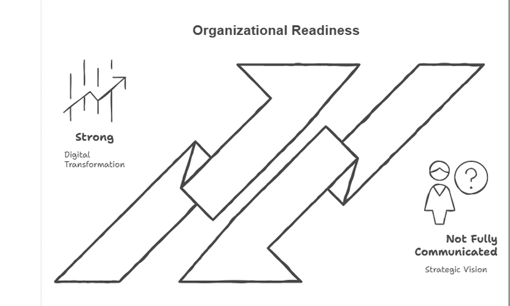
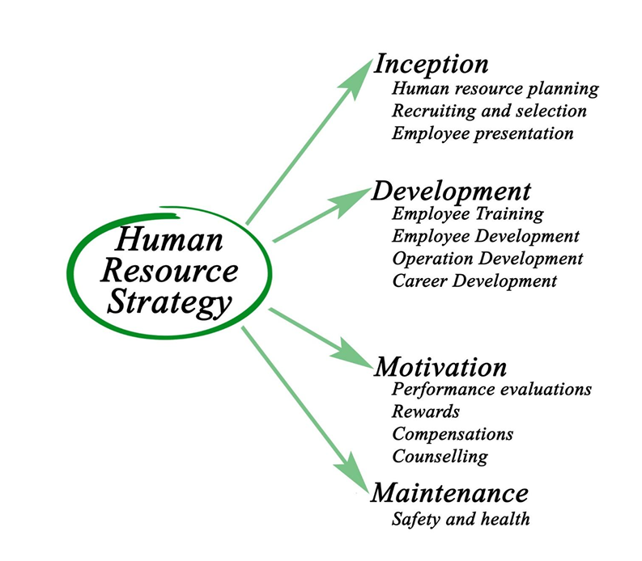
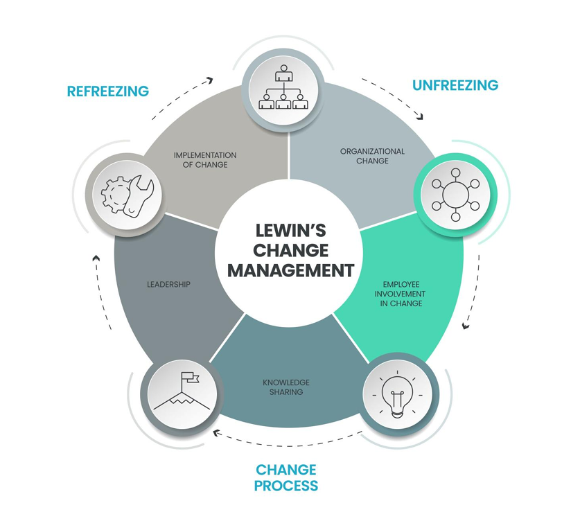

# Viksit Bharat @2047 — HR Practices & Organizational Readiness

An academic **Human Resource Management research project** examining how HR practices, workforce capabilities, leadership, and change management influence organizational readiness for long-term public-sector transformation in the context of **Viksit Bharat @2047**.

---

## 🎯 Research Objective

The primary objective of the study was to examine the role of Human Resource practices in enhancing organizational readiness for Viksit Bharat @2047.

Specific areas of investigation included:

- Employee awareness of Viksit Bharat @2047
- Organizational preparedness for future economic and technological change
- Training & Development
- Performance Management
- Employee Engagement
- Recruitment & Talent Management
- Change Management & Adaptability
- Workforce readiness
- Strategic HR transformation

---

## 🏢 Project Context

This project was developed as part of an **MBA Human Resource Management & Finance academic internship / on-the-job training dissertation**.

The research examines organizational readiness primarily from the perspective of public-sector banking and financial-services institutions.

The project focuses on academic analysis and does not represent an official assessment or position of any individual organization.

---

## 📊 Research Methodology

The study used a combination of **descriptive and analytical research approaches**.

### Analytical Framework

The analysis included:

- Descriptive Statistics
- Percentages and Frequency Distributions
- Mean Score Analysis
- Graphical Analysis
- Correlation Analysis
- Qualitative Interpretation

### Dataset

The analytical dataset consisted of **200 structured respondent profiles** representing junior, middle, and senior organizational levels.

Because direct access to public-sector personnel was restricted, the study used a **simulated/structured academic dataset** designed around realistic industry distributions and established research patterns.

No real employee personal data or confidential employee records were used.

### Measurement

A **5-point Likert Scale** was used to evaluate perceptions relating to:

- Organizational Readiness
- HR Practices
- Employee Awareness
- Change Management
- Leadership Support
- Digital Transformation

---

## 📊 Research Visuals

### Organizational Readiness



### HR Practices



### Change Management



---


## 🔬 Variables Studied

### HR Practice Variables

- Training & Development
- Recruitment & Talent Management
- Performance Management
- Employee Engagement

### Organizational Readiness Indicators

- Adaptability
- Digital Maturity
- Leadership Support
- Workforce Readiness

### Supporting Variables

- Age
- Experience
- Designation / Organizational Level

---

## 💡 Key Findings

The research identified several important patterns.

### 1. Moderate Awareness of Viksit Bharat @2047

Employee awareness of the national vision existed, but awareness had not consistently translated into strong individual ownership across all organizational levels.

### 2. Digital Progress vs. HR Readiness

Digital transformation was progressing, but HR systems remained comparatively functional and administrative rather than fully strategic.

This created a gap between technological modernization and human-capital readiness.

### 3. Change Management as a Critical Weakness

Resistance to change and the absence of sufficiently structured transition planning emerged as major barriers to organizational transformation.

### 4. Workforce Skill Gaps

Future-readiness requires stronger capabilities in:

- Artificial Intelligence
- Data Analytics
- Digital Tools
- Emerging Technologies
- Continuous Learning

### 5. Strategic HR Transformation

The findings indicate the need for HR to evolve from a primarily administrative function toward a **Strategic Human Resource Management (SHRM)** role supporting organizational transformation.

---

## 🚧 Critical Organizational Challenges

The research highlighted:

- Resistance to organizational change
- Digital and emerging-technology skill gaps
- Bureaucratic delays
- Weak innovation culture
- Fragmented communication
- Limited strategic alignment of HR systems
- Inadequate structured change-management mechanisms

---

## ✅ Recommendations

### HR-Level Recommendations

- Develop continuous learning and reskilling programs
- Strengthen AI, analytics and digital capability development
- Improve transparency in performance management
- Link performance more clearly with rewards
- Create employee idea-sharing and participation mechanisms

### Organizational Recommendations

- Reduce unnecessary bureaucratic barriers
- Encourage experimentation and innovation
- Modernize internal communication
- Strengthen leadership development
- Build strategic-thinking and emotional-intelligence capabilities among managers

### Change Management

- Introduce structured change-management frameworks
- Engage employees earlier during transformation
- Improve communication of change objectives
- Explain personal and professional benefits of transformation
- Build stronger employee participation during organizational change

### Policy Perspective

- Increase investment in digital transformation and advanced skills
- Modernize public-sector HR policies
- Improve alignment between organizational workforce strategies and national development programs

---

## 🛠️ Tools & Skills Demonstrated

**Research:** HR Research • Literature Review • Research Design

**HR Domain:** Strategic HRM • Organizational Readiness • Change Management • Training & Development • Performance Management • Employee Engagement

**Analytics:** Descriptive Statistics • Correlation Analysis • Likert Scale Analysis

**Tools:** Microsoft Excel • Data Visualization • Academic Research & Reporting

---

## 📈 Conceptual Framework

```text
HR Practices
     ↓
Organizational Readiness
     ↓
Contribution toward
Viksit Bharat @2047
```

HR practices such as Training, Recruitment, Performance Management and Employee Engagement are examined as drivers of organizational readiness, including adaptability, digital maturity and leadership support.

---

## ⚠️ Research Limitations

- The analytical dataset was simulated/structured for academic research because direct organizational access was limited.
- Results are based partly on perception-oriented Likert-scale measures.
- The study focuses primarily on public-sector banking and financial-services contexts.
- Findings should therefore be interpreted as academic analytical insights rather than organization-specific conclusions.
- Historical and simulated relationships should not be interpreted as proof of causation.

---

## 🎓 Academic Application

This project demonstrates practical application of:

- Human Resource Management theory
- Strategic HRM
- Organizational Change
- Research Methodology
- Workforce Readiness
- HR Analytics
- Academic Report Writing
- Business Research

---

## 👤 Author

**Obaid Ayoub**

MBA — Human Resource Management & Finance  
Central University of Jammu

HR & People Analytics | Strategic HRM | Workforce Analytics

[LinkedIn](https://www.linkedin.com/in/obaid-ayoub)
